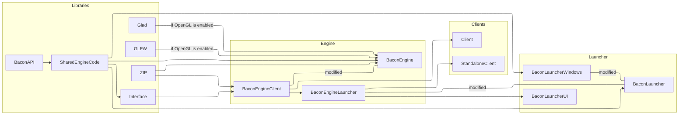

# Structure

```mermaid
flowchart-elk LR
    subgraph Libraries 
        bacon_api
        glad
        glfw
        zip
        shared_engine_code
        interface
    end
    
    bacon_api[BaconAPI]
    glad[Glad]
    glfw[GLFW]
    zip[ZIP]
    shared_engine_code[SharedEngineCode]
    interface[Interface]
    
    subgraph Engine 
        bacon_engine
        bacon_engine_client
        bacon_engine_launcher[BaconEngineLauncher]
    end

    bacon_engine[BaconEngine]
    bacon_engine_client[BaconEngineClient]

    subgraph Launcher 
        bacon_launcher
        bacon_launcher_ui
        bacon_launcher_windows
    end
    
    bacon_launcher[BaconLauncher]
    bacon_launcher_ui[BaconLauncherUI]
    bacon_launcher_windows[BaconLauncherWindows]
    
    subgraph Clients 
        client
        standalone_client
    end
    
    client[Client]
    standalone_client[StandaloneClient]
    
    bacon_api-->shared_engine_code
    glad-->|if OpenGL is enabled|bacon_engine
    glfw-->|if OpenGL is enabled|bacon_engine
    zip-->bacon_engine
    zip-->bacon_engine_client
    shared_engine_code-->bacon_engine
    shared_engine_code-->bacon_launcher
    shared_engine_code-->interface
    shared_engine_code-->bacon_launcher_windows
    interface-->bacon_engine_client
    
    bacon_engine_client-->client
    bacon_engine_client---|modified|bacon_engine
    bacon_engine_client-->bacon_engine_launcher
    bacon_engine_launcher---|modified|bacon_launcher
    bacon_engine_launcher-->bacon_launcher_ui
    bacon_engine_launcher-->standalone_client

    bacon_launcher_windows---|modified|bacon_launcher
```